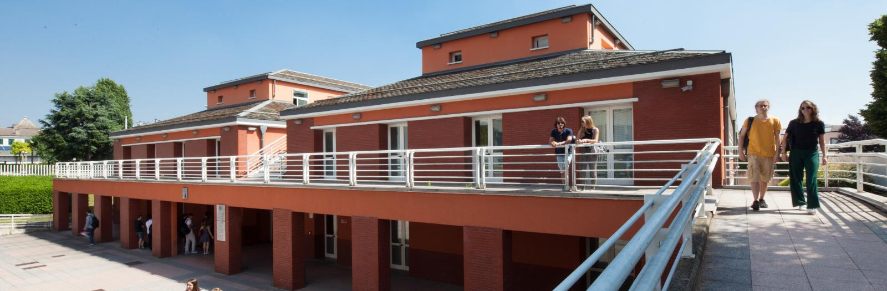

# University of Bergamo (UNIBG)

## Department of Engineering and Applied Sciences

### Industrial IoT – Short Course

---

### 📌 Objectives

- Understand the core concepts of IoT and LoRaWAN within the OSI Model.
- Configure and program LoRaWAN devices to transmit data via The Things Network (TTN) and/or ChirpStack.
- Connect sensors to LoRaWAN devices for environmental monitoring.
- Implement real-time communication using the MQTT protocol.
- Visualize and analyze IoT data using Node-RED, MongoDB, and Grafana.

📧 For questions or suggestions, contact: [dhiego.fernandes@unibg.it](mailto:dhiego.fernandes@unibg.it)

### ✅ Requirements

- Arduino IDE 
- TTN or ChirpStack account
- USB cable for Arduino MKR WAN 1310
- Sensor module (e.g., DHT11, BMP280, etc.)
- Node.js installed (for Node-RED)
- MongoDB and Grafana set up locally or on a server

---

### 💡 Notes

This course is part of the Department of Engineering and Applied Sciences at UNIBG and aims to provide practical experience in Industrial IoT solutions using LPWAN technologies and cloud-based tools.

---

## 🗓️ Course Structure

> **Format:** 3 sessions of 2 hours each  
> **Platform:** Arduino MKR WAN 1310 + LoRaWAN (TTN or ChirpStack) + MQTT + Node-RED/MongoDB/Grafana

---

### 📘 Week 01 – IoT and LoRaWAN Fundamentals (2h)

- **Slides:**  
  [ IoT and LoRaWAN – Fundamentals for Industrial Applications](lessons/week_01/week_01_IoT_LoRaWAN_Industrial_IoT_Dhiego.pdf)

- **Hands-on:**  
  [Sending LoRaWAN messages from Arduino MKR WAN 1310 to TTN](lessons/week_01/sources/)

---

### 🔧 Week 02 – ChirpStack, LoRaWAN Settings & MQTT Integration (2h)

- **Hands-on:**  
  [Connecting Arduino MKR WAN 1310 to ChirpStack (Docker) and exploring LoRaWAN settings (DR, ADR, confirmed/unconfirmed messages) with basic MQTT via Node-RED](lessons/week_02/sources/)

---

### 🌐 Week 03 – Sensor Integration & Full Data Pipeline (2h)

- **Hands-on:**  
  [Reading sensor data from Environment 3 Click and visualizing it through ChirpStack, MQTT, Node-RED, InfluxDB, and Grafana](lessons/week_03/sources/)

---

