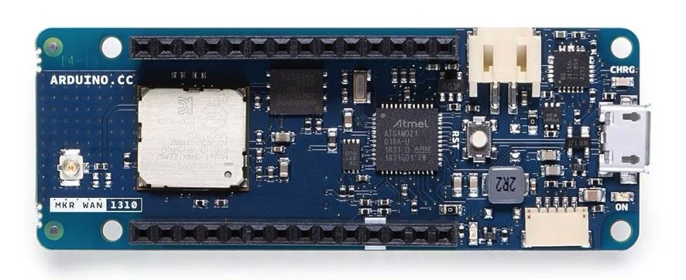

# Sending LoRaWAN messages from Arduino MKR WAN 1310 to TTN

    

## 🎯 Objective

In this first session, you will learn how to connect the Arduino MKR WAN 1310 to **The Things Network (TTN)** using **OTAA (Over-The-Air Activation)**. This exercise demonstrates how to send a simple message from the device to the LoRaWAN server.

---

## 🛠️ What You’ll Need

- 1x Arduino MKR WAN 1310
- USB Cable
- Internet connection
- Arduino IDE installed
- TTN account
- One of the assigned LoRaWAN credentials (see below)

---

## ⚙️ Initial Setup

Before you begin, make sure to:

1. **Install the board package**  
   Open Arduino IDE → Go to **Tools > Board > Board Manager**  
   Search for and install: `Arduino SAMD Boards`

2. **Install the required library**  
   Go to **Tools > Manage Libraries...**  
   Search for and install: `MKRWAN`

3. **Load the example sketch**  
   File → Examples → **MKRWAN** → `LoRaSendAndReceive`  
   This is the base code we’ll use.
   Or you can also download direct from [here](./LoraSendAndReceive/)

---

## 🔐 Device Credentials

Each device used in class is labeled with a number (01, 02, 03). Use the corresponding credentials when configuring your sketch:

| Device | `devEUI`             | `appEUI`             | `appKey`                              |
|--------|----------------------|----------------------|----------------------------------------|
| 01     | A8610A3233187404     | AA99887766554433     | AA99887766554433AA99887766554433       |
| 02     | A8610A34352D810E     | 9988776655443322     | 99887766554433229988776655443322       |
| 03     | A8610A3233367504     | 8877665544332211     | 88776655443322118877665544332211       |

⚠️ **Note:** You must insert your `appEUI` and `appKey` directly into the sketch before uploading.

---

## 🧪 What Happens in the Code

1. The device attempts to join TTN via OTAA.
2. If successful, it will print the `devEUI` and firmware version to the Serial Monitor.
3. It will then send the defined message, which is **automatically converted to hexadecimal** before transmission.

---

## 📂 Directory Structure

week_01/
├── README.md
└── sources/
    ├── lesson_images/
    └── LoRaSendAndReceive/
        ├── LoRaSendAndReceive.ino
        ├── arduino_secrets.h

---

## 🧭 Additional Tips

- Open the **Serial Monitor** at 9600 baud to observe the join and send process.
- Make sure your Arduino MKR WAN 1310 is correctly selected under **Tools > Board** and **Tools > Port**.
- Check that your device is properly registered in **TTN Console** with matching `devEUI`, `appEUI`, and `appKey`.

---

## ❓Need Help?

Contact [dhiego.fernandes@unibg.it](mailto:dhiego.fernandes@unibg.it)

