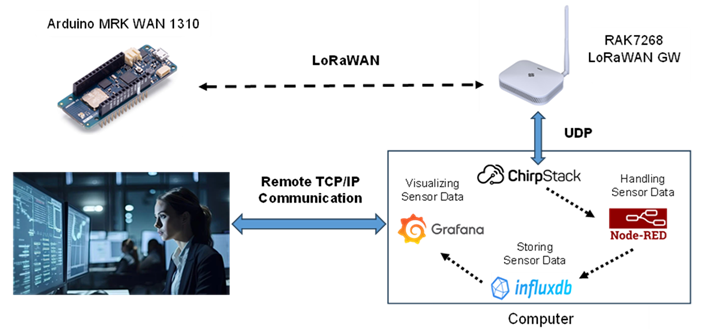

# Full IoT Pipeline with Data Visualization 

<div align="center">
    
</div>

## 🎯 Objective

This final session demonstrates a complete Industrial IoT data flow using LoRaWAN. Students will visualize sensor data sent from an Arduino MKR WAN 1310 through ChirpStack, integrated via MQTT with Node-RED, stored in a time-series database (InfluxDB), and visualized using Grafana dashboards.

---

## 🛠️ What You’ll Need

- **Arduino MKR WAN 1310** (same configuration as Week 2)
- **Docker Desktop** (already installed)
- **ChirpStack (Docker version)** (already running from Week 2)
- **Node-RED for Windows** (already installed)
- **InfluxDB for Windows** (new installation)
- **Grafana for Windows** (new installation)
- Same sketch used in Week 2: [`LoRaSendAndReceiveUpdated`](../../week_02/sources/LoRaSendAndReceiveUpdated/)

---

## ⚙️ Installation Steps

### 1. 🛠️ Install InfluxDB

- **InfluxDB**:  
  Download and install from [https://portal.influxdata.com/downloads/](https://portal.influxdata.com/downloads/)

> If you having any trouble to install InfluxDB on Windows, check [this video on Youtube](https://www.youtube.com/watch?v=C-Anc1OeOpg).
> You can use either as the time-series database for this activity.

After installation:
- Type `influxd` in your command prompt on windows
- Access Influx via [http://localhost:8086](http://localhost:8086)  
- Set up your username, password, and organization name

---

### 2. 📊 Install Grafana

Download Grafana for Windows:  
👉 [https://grafana.com/grafana/download](https://grafana.com/grafana/download)

> Grafana installation guide on [Youtube](https://www.youtube.com/watch?v=v7Bxka2Fb1g).

After installation:
- Access Grafana via [http://localhost:3000](http://localhost:3000)  
- Default login: `admin` / `admin`  
- Set up your data source (InfluxDB)

---

## 🔁 Reusing the Arduino Sketch

Use the same sketch from Week 2:  
📂 [`LoRaSendAndReceiveUpdated`](../../week_02/sources/LoRaSendAndReceiveUpdated/)

- The device will send simulated sensor data (or dummy values).
- Uplink messages are transmitted via LoRaWAN to ChirpStack.
- ChirpStack forwards data to the local MQTT broker.

---

## Import Node-Red Flow

You can import the nodered flow [here](./node-red/chirpstack-mqtt-integration-influxdb.json)
- Your flow will be integrated to mqtt server.
- Your LoRaWAN data flow will be stored in Influx database.

---

## Import Grafana Dashboard

You can import the Grafana Dashboard [here](./grafana/grafana.json)
- Visualizing your LoRaWAN Data Pipe Line in a friendly grafic dashboard.

---

## 🔗 Integration Flow

1. **ChirpStack** receives uplinks from the Arduino via a LoRaWAN gateway.
2. **MQTT** publishes uplink messages on `application/"appplicationID"/device/"deviceEUI"/event/up`.
3. **Node-RED** subscribes to MQTT and parses the payload.
4. The data is stored in **InfluxDB**.
5. **Grafana** queries the database and displays the data in dashboards.

---

## 📂 Directory Structure

```plaintext
week_03/
├── README.md
└── sources/
    ├── grafana/
    |   └── grafana.json 
    ├── lesson_images/
    ├── node-red/
        └── chirpstack-mqtt-integration-influxdb.json
     


